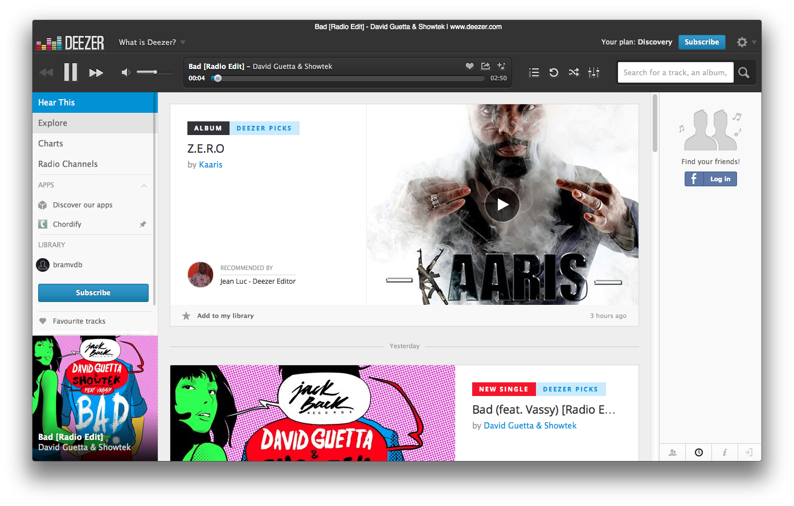

DeezPlayer
================

DeezPlayer is a native wrapper around the Deezer website for Mac OS X.
Support is added for the media keys (F7-F8-F9).

## Screenshots

## Download

Downloads will be available form the releases page.
## Known issues

* When you try to login with your Facebook or Google+ account, no window opens so you cannot login with Facebook or Google+

## About this project
I'm not the creator of the application, I just made some minor tweaks like changing the color of the title bar. I was also working on a fix for the Facebook login issue.

I will make a pull request when the Facebook thing also works.
